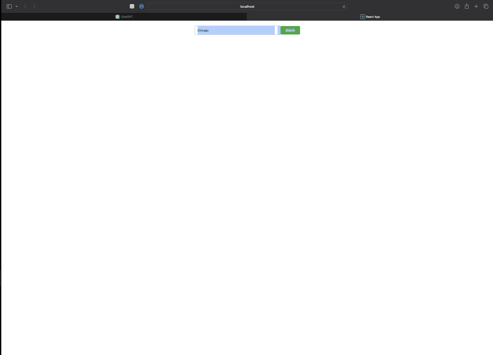
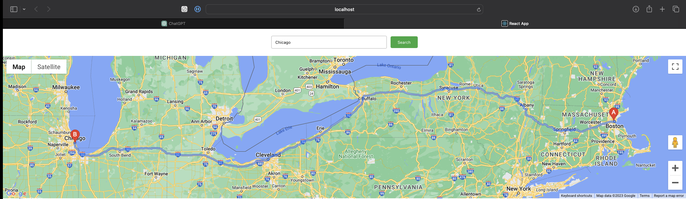
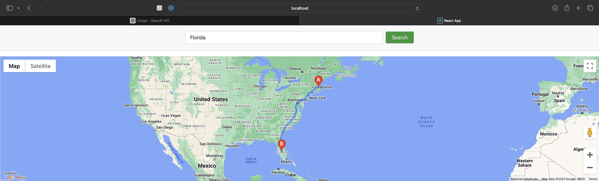

# maps_api_project
Sample maps API project to get directions to a searched place

# React App with Google Maps Integration

This project is a React application that integrates with the Google Maps API to search for places and display directions.

## Prerequisites

Before you begin, ensure you have the following installed:
- Node.js and npm (Node.js package manager)

## Installation

To set up the project for development on your local machine, please follow these steps:

1. Clone the repository to your machine.

```bash
git clone https://github.com/your-username/maps_api_project.git
cd directions-api-app
```

## Install necesarry packges and set up environment

```
npm install
npm install @react-google-maps/api  
```
 
Set up your environment variables. Create a .env file in the root of your project and add your Google Maps API key as follows:

```
REACT_APP_GOOGLE_MAPS_API_KEY=your_actual_api_key
```

Replace your_actual_api_key with your Google Maps API key. Currently, we just manually load the api key into a string in src/components/MapComponent.js, but this can be altered to read your environment variable with the api key instead.


Run the app

```
npm start
```

For production

```
npm run build

```

## User story

- "I am looking to go on a road trip and need directions from my current location to my destination"
- "I am curious what route to take to get from where I am to ____"
- "I want to plan a business trip and see if my daughter's soccer practice would be on the way"

## Proof of concept

---- Picture of app before search is performed ----




---- Picture of app after search is performed ----




---- Picture of app after another search is performed ----




---- Picture of app after another search is performed and fullscreened ----


